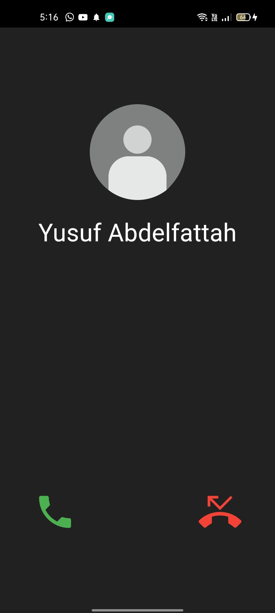

# Get Me Out

Get Me Out is a Flutter mobile application designed to help users gracefully exit awkward or uncomfortable situations by triggering a fake call with a simple action that will allow you to get an excuse to leave that uncomfortable situation.

## Features

- **Quick Exit:** Press the volume up button three times to trigger a fake call, providing users with a convenient excuse to leave awkward or unwanted conversations or situations.

## Screenshots

{:height="300px" width="400px"}

## Installation

Download [Get Me Out](Get%20Me%20Out.apk) APK

## Usage

Once installed, follow these steps to use Get Me Out:

1. Launch the app on your device.
2. Press the volume up button three times to trigger a fake call.
3. Use the fake call as an excuse to gracefully exit awkward or uncomfortable situations.

## Contributing

Contributions are welcome! If you'd like to contribute to Get Me Out, please follow these steps:

1. Fork the repository.
2. Create a new branch (`git checkout -b feature/my-feature`).
3. Make your changes.
4. Commit your changes (`git commit -am 'Add my feature'`).
5. Push to the branch (`git push origin feature/my-feature`).
6. Create a new Pull Request.

## Credits

Get Me Out was created by [@YUSUF-SELEIM](https://github.com/YUSUF-SELEIM) and is maintained by [@YUSUF-SELEIM](https://github.com/YUSUF-SELEIM) and Contributors.

Many Thanks to:
<a href="https://www.freepik.com/icon/user_8742495">Icon by Pop Vectors</a>
<a href="https://www.flaticon.com/free-icons/sos" title="sos icons">Sos icons created by Freepik - Flaticon</a>